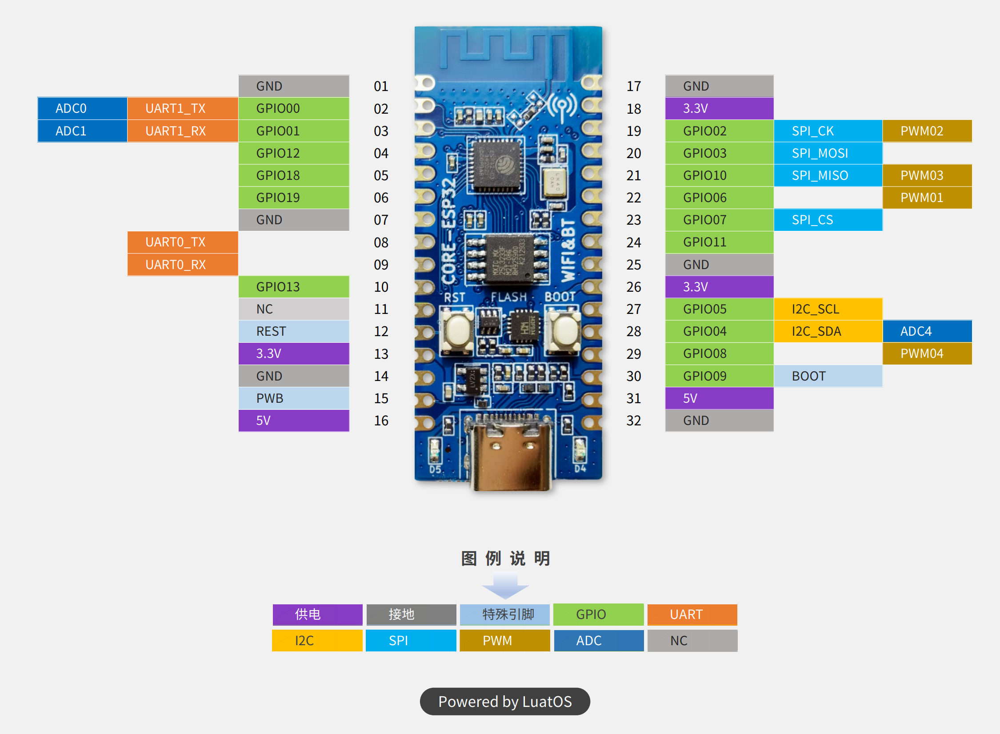
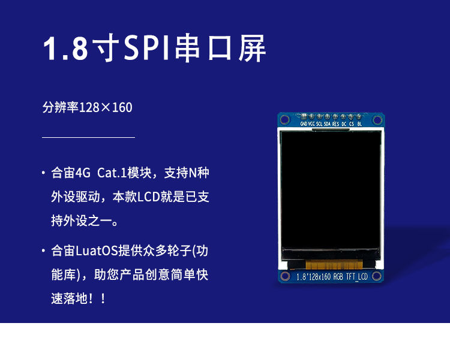

# Conway's Game of Life

Demo run on a esp32-c3 microcontroller with a tft screen. with Arduino framework.

# Which Microcontroller?



- MCU: Espressif ESP32-C3
- Vendor: LuatOS

Manual of Board is [here](https://wiki.luatos.com/chips/esp32c3/board.html)

# Which Screen?



A 1.8" TFT Screen drive by ST7735. Has 128x160 pixels, 16bit(65536) colors, render with RGB565.

Manual of Screen is [here](https://wiki.luatos.com/peripherals/lcd_1in8_128x160/index.html)

# How to build

You need [PlatformIO](https://platformio.org/), Any of [CLI](https://docs.platformio.org/en/latest/core/index.html) or [IDE](https://docs.platformio.org/en/latest/integration/ide/pioide.html).

build with platformio-cli(aka pio):

```shell
cd project-dir

# build
pio run

# flash
pio run -t upload
```
